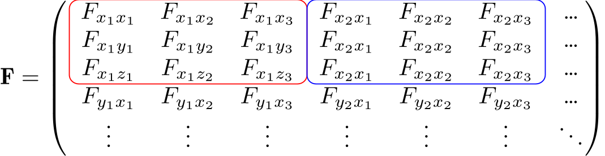
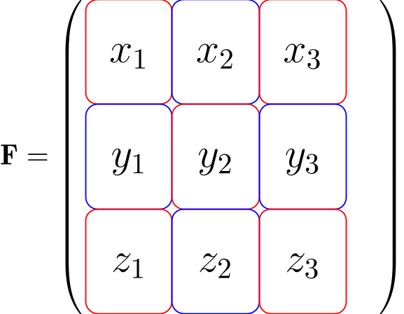

# Hessian explanation

I want to spoiler the solution and then explain, why this works and why 
this is correct.

The Hessian has the form of 

or with an overview: 

this is a bit missleading as we need four counter in order to catch all 
the terms and to replicate all the indices in the matrix.
After the correct evaluation of the Hessian we get mass-weighted Hessian by
$$
    F_{ij}^M = \frac{F_{ij}}{\sqrt{m_i m_j}}
$$
which is kinda fake, because this only accounts for 1/9 of the real matrix, because
we need to account for all the cartesian coordinates. 